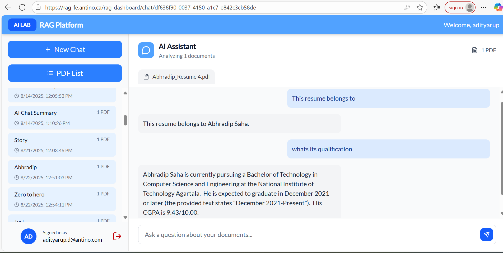
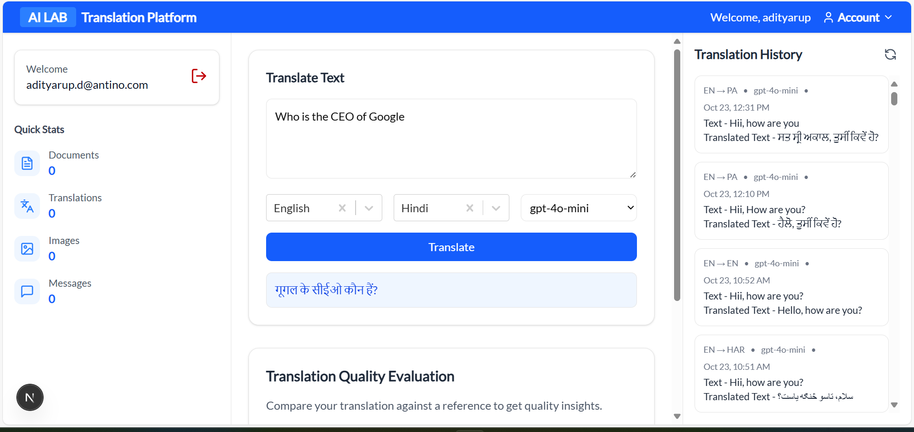
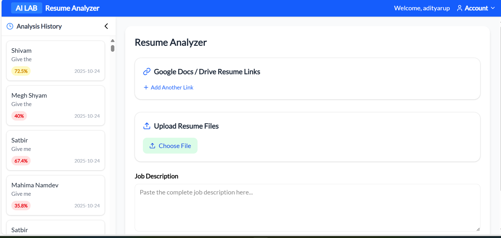
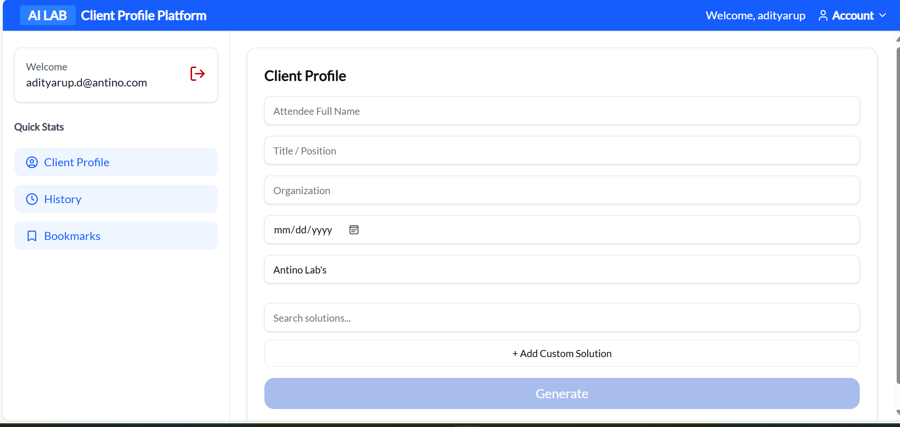

# AI_LAB Project

## Description

AI_LAB is a full-stack AI project consisting of multiple services: **RAG (Retrieval-Augmented Generation)**, **Translation**, **Resume Analyzer**, and **Client Profiling**.  

- Node.js backend acts as a mediator between React frontend and Python AI services.  
- RAG module allows uploading multiple PDFs and provides interactive Q&A.  
- Translation service supports multi-language text translation.  
- Resume Analyzer processes PDF, Google Drive, and local resumes, extracting name, skills, ATS score, and other insights.  
- Client Profiling gathers professional information from LinkedIn and social media.

## Demo
[Watch AI_LAB Demo](https://www.loom.com/share/c3fbd28602ca4ef697eddd17059bf823)








## Installation

```bash
$ npm install
```

## Running the app

```bash
# development
$ npm run start

# watch mode
$ npm run start:dev

# production mode
$ npm run start:prod
```

## Test

```bash
# unit tests
$ npm run test

# e2e tests
$ npm run test:e2e

# test coverage
$ npm run test:cov
```

## Support

Nest is an MIT-licensed open source project. It can grow thanks to the sponsors and support by the amazing backers. If you'd like to join them, please [read more here](https://docs.nestjs.com/support).

## Stay in touch

- Author - [Kamil Myśliwiec](https://kamilmysliwiec.com)
- Website - [https://nestjs.com](https://nestjs.com/)
- Twitter - [@nestframework](https://twitter.com/nestframework)

## License

Nest is [MIT licensed](LICENSE).
